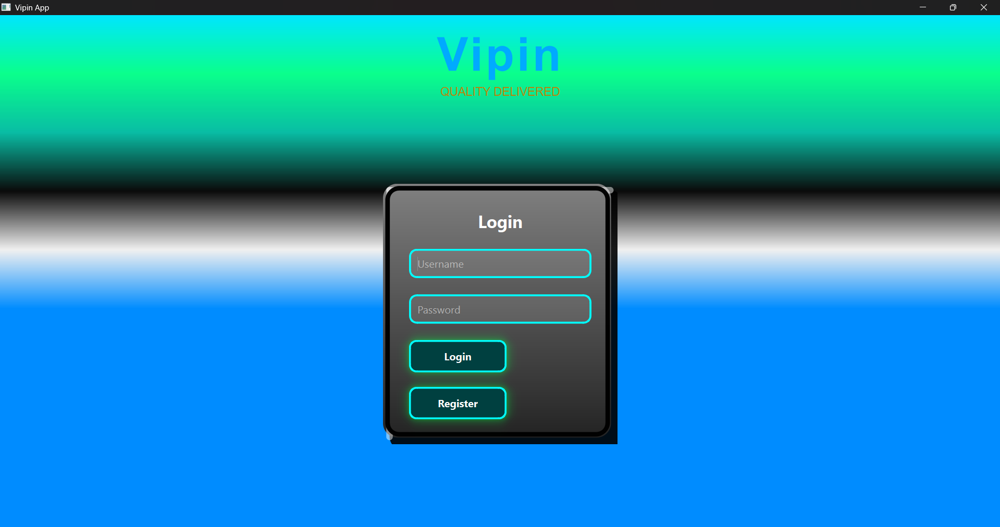

# 🏭 EOL Test Platform — Industrial Automation Suite

<div align="center">


**A production-grade End-of-Line (EOL) automated testing framework built for Dashcam and E-Call device manufacturing lines.**

*Deployed across 10+ industrial production lines | 95% reduction in manual QA errors*

</div>

---

## 📸 Screenshots

| Login Screen | Device Configuration | Barcode Entry |
|:---:|:---:|:---:|
|  |  |  |

| Main Command Panel | PSU Controller |
|:---:|:---:|
|  |  |

---

## 🚀 Key Features

### 🔌 Multi-Device Hardware Integration
- **Serial Communication** — Real-time ECALL & DASHCAM device testing via PySerial (HEX/ASCII protocol)
- **NI-DAQmx Digital I/O** — USB-6501 / PCIe-6509 control for relay switching, conveyor triggers & sensor interfacing
- **Keysight PSU Control** — PyVISA-based automated voltage/current setting with live status monitoring
- **Modbus RTU dB Meter** — Industrial noise level measurement with CRC16 Modbus frame parsing
- **Ethernet Camera Integration** — TCP socket-based camera communication for vision test triggers
- **FEASA Photometric Sensor** — Optical measurement integration for LED/display validation

### 🧠 Intelligent Test Engine
- **Flexible Pattern Matching** — HEX/ASCII/DEC response parsing with range-based `[min-max]` token matching
- **Asynchronous Architecture** — Multi-threaded test execution; GUI never freezes during long test sequences
- **DAQ-Triggered Auto-Run** — NI DAQ hardware trigger (falling edge) auto-starts full test sequence
- **Smart ENTRY/EXIT Flow** — Timeout detection with automatic emergency EXIT command execution
- **Multi-Step DB Meter Checks** — Sequential dB measurements with per-step pass/fail thresholds
- **Dynamic Date Commands** — Auto-injects current date into device commands (e.g., SET DATE OF MANUFACTURER)

### 📊 Reporting & Analytics
- **PDF Report Generation** — A3 landscape reports with company logo, barcode traceability, and color-coded PASS/FAIL
- **Excel Export** — Per-unit `.xlsx` reports + daily cumulative `ECALL_ID.xlsx` with barcode history
- **Live Yield Tracking** — Real-time Total / PASS / FAIL / Yield% counters with JSON persistence across restarts
- **Elapsed HUD Timer** — Per-run stopwatch displayed on command panel

### 🔐 Security & Access Control
- **Role-Based Login** — JSON-based user management with Admin/Operator roles
- **Admin Control Panel** — Register/delete users, change admin password — all protected behind admin auth
- **Settings Lock** — COM port and device settings locked until admin unlocks; changes require re-authentication

### 🎨 GUI Design
- **Neon Cyberpunk Theme** — Animated glowing borders, gradient backgrounds, conical glow buttons
- **3D Card Widget** — Custom `QPainter`-rendered metallic card with edge highlights
- **Live Glow Animations** — `QPropertyAnimation` cycling glow effects on all major frames
- **Real-Time Auto-Scroll** — Test table auto-scrolls to currently running row

---

## 🏗️ Architecture Overview

```
┌─────────────────────────────────────────────────────────┐
│                    PyQt6 GUI Layer                       │
│  LoginWindow → ComPortSettings → BarcodeScreen → Main   │
└──────────────────────┬──────────────────────────────────┘
                       │
┌──────────────────────▼──────────────────────────────────┐
│                  Test Engine Core                        │
│  run_all_tests() → run_test_case() → match_pattern()    │
└──┬──────────┬──────────┬──────────┬────────────┬────────┘
   │          │          │          │            │
   ▼          ▼          ▼          ▼            ▼
Serial     NI-DAQ    PyVISA     Modbus       Ethernet
(ECALL/   (USB-6501) (Keysight  (dB Meter)  (Camera)
DASHCAM)             PSU)
   │          │          │          │            │
   └──────────┴──────────┴──────────┴────────────┘
                       │
┌──────────────────────▼──────────────────────────────────┐
│              Report Generation Layer                     │
│         ReportLab (PDF)  +  OpenPyXL (Excel)            │
└─────────────────────────────────────────────────────────┘
```

---

## 🔧 Tech Stack

| Category | Technology |
|---|---|
| GUI Framework | PyQt6 (QWidget, QThread, QPropertyAnimation) |
| Serial Protocol | PySerial — HEX frame send/receive |
| Hardware I/O | NI-DAQmx (nidaqmx Python API) |
| Instrument Control | PyVISA — SCPI over TCP/IP |
| Industrial Protocol | Pymodbus — Modbus RTU over RS-485 |
| PDF Reports | ReportLab (platypus, tables, images) |
| Excel Reports | OpenPyXL (styled workbooks, images) |
| Networking | Python `socket` — TCP/IP camera control |
| Data Persistence | JSON (users, settings, counters) |
| Threading | Python `threading` + Qt signal/slot bridge |

---

## 📁 Project Structure

```
eol-test-platform/
│
├── README.md
├── requirements.txt
├── .gitignore
├── main.py                      # Entry point
│
├── core/
│   ├── test_runner.py           # run_all_tests, run_test_case
│   ├── serial_utils.py          # send_hex, read_serial_response
│   ├── daq_controller.py        # niusb_write_line, niusb_set_low
│   ├── pattern_matcher.py       # match_pattern_over_bytes, RANGE_RE
│   ├── report_generator.py      # generate_report (PDF)
│   ├── excel_exporter.py        # generate_excel (XLSX)
│   └── counter_manager.py       # load/save/refresh counters
│
├── gui/
│   ├── login_window.py          # LoginWindow, AdminRegistrationPopup
│   ├── com_port_screen.py       # ComPortSettingsScreen
│   ├── barcode_screen.py        # BarcodeScreen
│   ├── main_screen.py           # MainScreen (command panel)
│   ├── psu_controller.py        # PSUController (Keysight)
│   ├── ni_daq_controller.py     # NIDAQController
│   └── widgets.py               # GlassyNeonButton, Extreme3DCard
│
├── config/
│   ├── test_cases_example.py    # Sanitized example test cases
│   └── settings_template.json  # Template (no real IPs/ports)
│
└── screenshots/
    ├── login.png
    ├── com_port.png
    ├── barcode.png
    ├── dashboard.png
    └── psu_controller.png
```

---

## ⚡ Quick Start

### Prerequisites
- Windows 10/11 (NI-DAQmx driver required)
- Python 3.11+
- NI-DAQmx driver installed from [ni.com](https://www.ni.com/en/support/downloads/drivers/download.ni-daq-mx.html)
- Keysight IO Libraries Suite (for PyVISA instrument control)

### Installation

```bash
# 1. Clone the repository
git clone https://github.com/vipin-parmar/eol-test-platform.git
cd eol-test-platform

# 2. Install dependencies
pip install -r requirements.txt

# 3. Configure settings (copy template, fill in your values)
cp config/settings_template.json com_settings.json

# 4. Run the application
python main.py
```

### Default Credentials
```
Username: Admin
Password: Admin@123
```
> ⚠️ Change the admin password immediately after first login via the Register panel.

---

## ⚙️ Configuration

All hardware settings are stored in `com_settings.json` (created on first run):

```json
{
  "ecall_com": "COM3",
  "dashcam_com": "COM4",
  "db_meter_com": "COM5",
  "feasa_com": "COM6",
  "camera_ip": "192.168.x.x",
  "camera_port": "5000",
  "psu_ip": "192.168.x.x",
  "ni_device_1_serial_hex": "XXXXXXXX",
  "ni_device_2_serial_hex": "XXXXXXXX",
  "ni_device_3_serial_hex": "XXXXXXXX"
}
```

> 🔒 This file is in `.gitignore` — your real IPs/ports will never be committed.

---

## 📋 Defining Test Cases

Test cases are defined as a Python list of dictionaries in `TEST_CASES`:

```python
TEST_CASES = [
    # Simple HEX command with expected response
    {
        "name": "GET FIRMWARE VERSION",
        "channel": "ECALL",
        "input_cmd": "B1 01 01",
        "expected": "B1 02",
        "delay": 0.5
    },

    # Range-based validation [min-max]
    {
        "name": "GET BATTERY VOLTAGE",
        "channel": "ECALL",
        "input_cmd": "B3 03 9E",
        "expected": "B3 03 9E [360-440]",
        "min": 360,
        "max": 440,
        "delay": 1
    },

    # NI-DAQ only step (no serial command)
    {
        "name": "SHUTTER OPEN",
        "background_cmd": "DAQ_ONLY",
        "daq_steps": [
            {"serial": "ni_device_1", "port": 1, "line": 6, "state": 0, "wait": 5}
        ]
    },

    # dB Meter measurement with range check
    {
        "name": "MIC NOISE LEVEL",
        "channel": "ECALL",
        "input_cmd": "B5 01 10",
        "expected": "B5 02",
        "dbmeter_cmd": True,
        "min": 60,
        "max": 90,
        "delay": 2
    }
]
```

---

## 📈 Production Metrics

This platform has been deployed and validated in production:

| Metric | Value |
|---|---|
| Production Lines Deployed | 10+ |
| Manual QA Error Reduction | 95% |
| Test Throughput Improvement | 80% faster vs. manual |
| Report Accuracy | 100% automated (0 manual entry) |
| Supported Device Types | Dashcam, E-Call (eCall 2.0) |

---

## 🗺️ Roadmap

- [ ] OPC-UA integration for MES/SCADA connectivity  
- [ ] ONNX/TensorRT model deployment for edge vision inference  
- [ ] Docker containerization for easy deployment  
- [ ] REST API layer for remote test triggering  
- [ ] SQLite database backend (replace JSON counters)  
- [ ] Dark/Light theme toggle  

---

## 👨‍💻 Author

**Vipin Parmar** — R&D Engineer | Industrial Automation & Edge AI

[](https://www.linkedin.com/in/vipin-parmar-aa9360214)
[](mailto:parmarvipin17@gmail.com)
[](tel:+917988046490)

---

## 📄 License

This project is licensed under the MIT License — see [LICENSE](LICENSE) for details.

> **Note:** Hardware-specific configurations (COM ports, IP addresses, NI device serials) are intentionally excluded from this repository. Use `settings_template.json` as a starting point.

---

<div align="center">

*Built with for real industrial manufacturing environments*

**Industrial Automation • Machine Vision • Embedded Intelligence**

</div>
